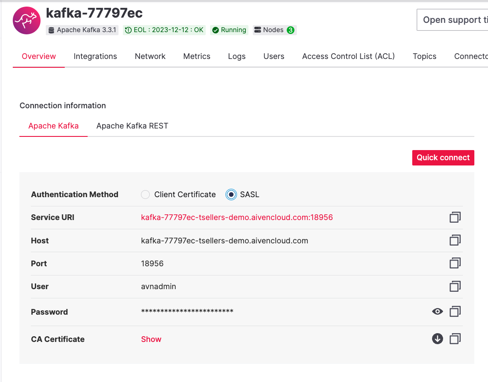
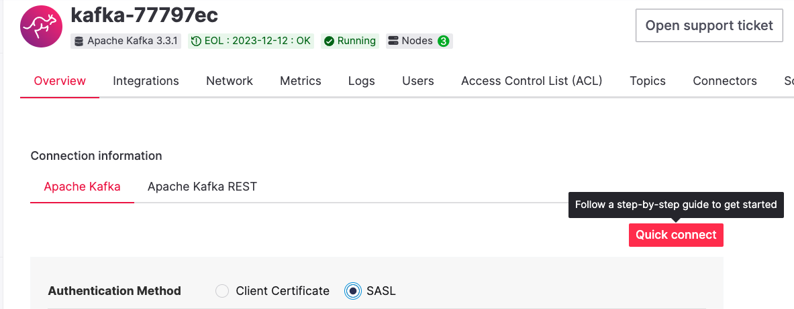

# Kakfa SASL Auth

An example of getting Aiven Kafka producer with SASL Authentication.

## dotenv 
Uses dotenv-java that requires a .env file in the root of the project. 

copy the `example.env` to `.env` and fill in the required configuration.

Notice the selected SASL option here (port is different!)



## Run

Firstly, you want to get the java credentials to use. 

Create the keystore by following the instructions in the "Quick Connect" box


or simply use the [Aiven CLI](https://docs.aiven.io/docs/tools/cli/service/user#avn-service-user-kafka-java-creds) 

This will create a directory `creds` and download the required java keystore to it. 
```
$> mkdir creds
$> avn service user-kafka-java-creds --project <YOUR AIVEN PROJECT> --username avnadmin -p <A GOOD PASSWORD> -d creds <YOUR KAFKA SERVICE NAME>
```

This was built in VSCode and has really only ever been executed there using openJDK@19 (installed homebrew on mac with M1 chip)

Clone this repository, run `mvn clean compile` at a minimum to get the dependencies

From there, the [Run and Debug](https://code.visualstudio.com/docs/java/java-debugging) window in Java Extension for VSCode was used. 
